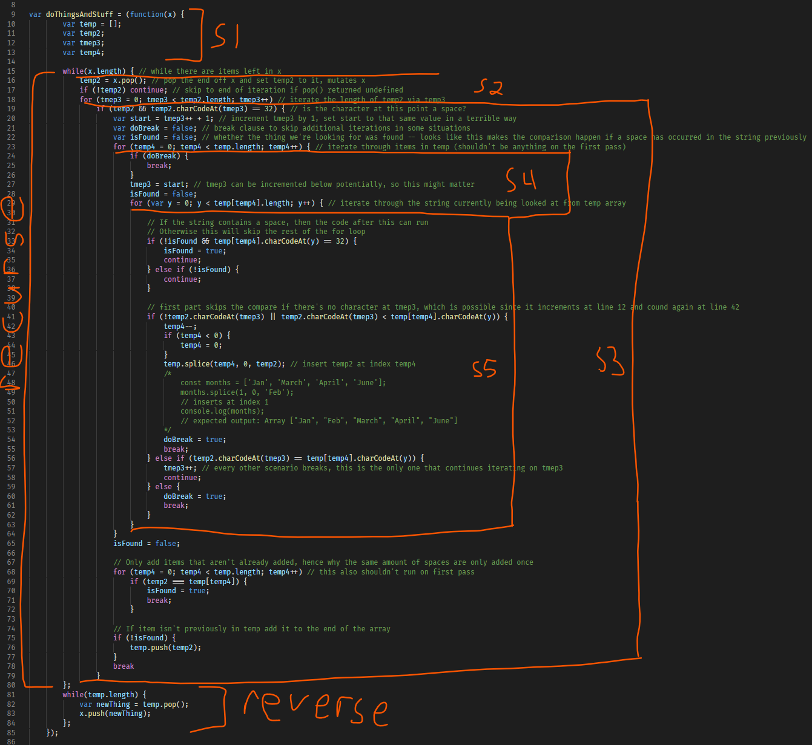
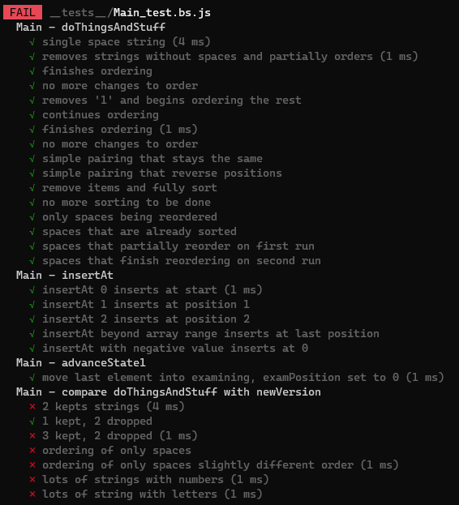
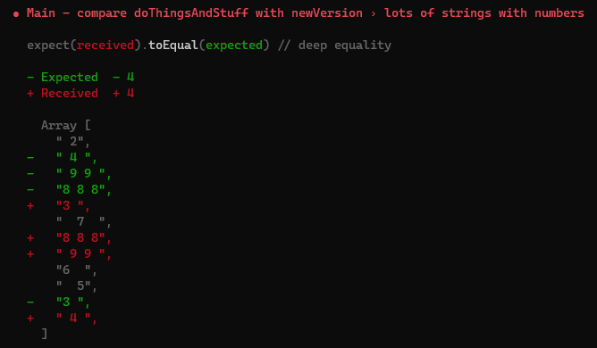
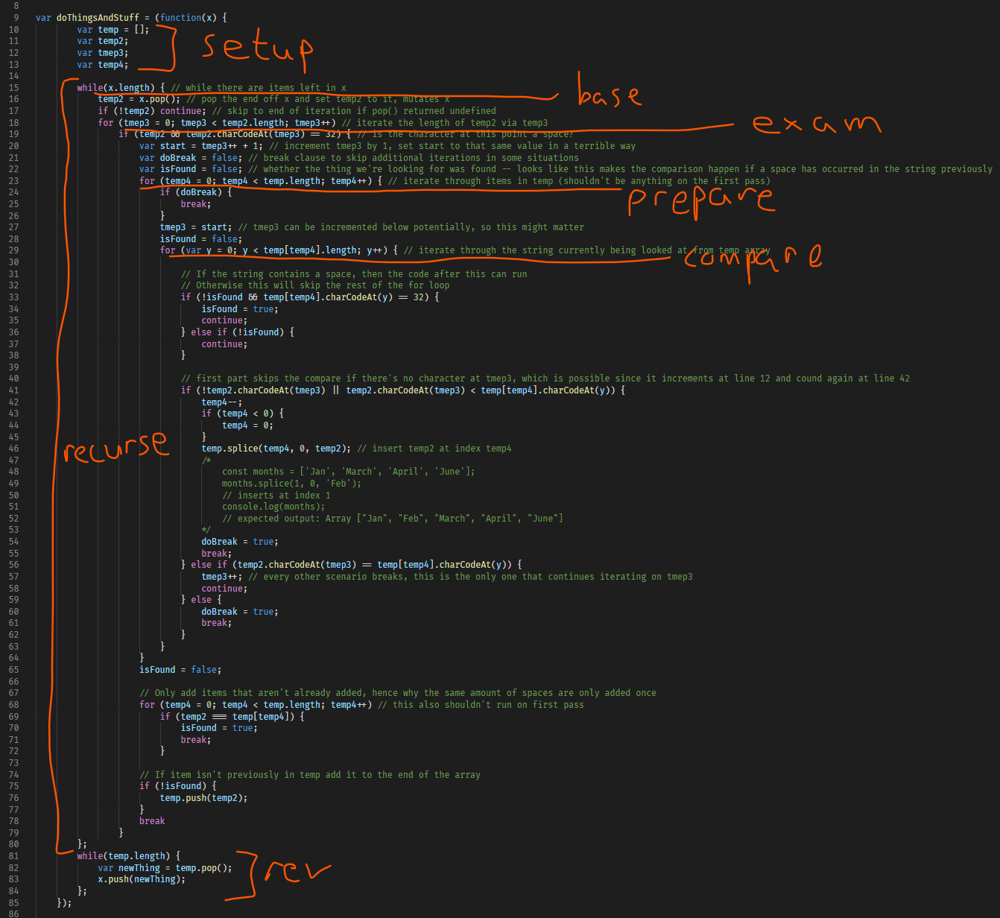
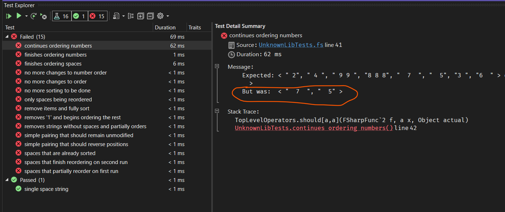

# Code exercise
This is a code exercise for a potential employer. Trying to translate some rather interesting imperative code into a more functional approach.

# Notes
## Is it just a filtersort?
That's what I thought at first, when testing a few very basic examples. Such as:
```
Input:  ["     ", "   ", " "]
Output: ["     ", "   ", " "]
```

These examples are the input/output of the original `doThingsAndStuff` function. Input in this case meaning the original value of `x` before running `doThingsAndStuff` against it, the output being the result of that (ReScript/ReasonML example):
```ocaml
let x = ["a", " b", "c ", "d", "eeeee", "f  f", "gg", "  "] // input
doThingsAndStuff(x) -> ignore
Js.log(x) // writing output back to console
```

Once getting items in different orders and introducing characters with strings things became a bit more interesting:
```
Input:  ["   ", "foo", " ", "bar", "     "]
Output: ["     ", " ", "   "]
```

The order doesn't seem like anything I'd call sorted, since all 3 strings are just spaces they should order by size typically. It looks like `doThingsAndStuff` is intended to do some kind of sorting. Could be a function that takes multiple passes to sort... Wonder what happens if we run that last output as the new input?
```
Input:  ["     ", " ", "   "]
Output: [ "     ", "   ", " " ]
```

Ok, now we're getting somewhere. The strings are ordered largest to smallest after another pass, reinforcing the idea of a multi-pass sort somewhat.

## Definitely not just filtering and sorting
Next up came some experimenting (experimenting.js in this repo) to allow me to rapid fire test some different inputs. The results are definitely interesting, but here are a few noteworthy parts starting with the fact that final order depends on input order:
```
Input : [" 2", "3 ", " 4 ", "  5", "6  ", "1", "  7  ", "8 8 8", " 9 9 "]
Once  : [" 2", " 4 ", " 9 9 ", "8 8 8", "  7  ", "6  ", "  5", "3 "]
Twice : [" 2", " 4 ", " 9 9 ", "8 8 8", "  7  ", "  5", "3 ", "6  "]
Thrice: [" 2", " 4 ", " 9 9 ", "8 8 8", "  7  ", "  5", "6  ", "3 "]
Last  : [" 2", " 4 ", " 9 9 ", "8 8 8", "  7  ", "  5", "6  ", "3 "]

Input : ["1", " 4 ", "8 8 8", " 9 9 ", "  5", "6  ", " 2", "3 ", "  7  "]
Once  : [" 4 ", "8 8 8", " 9 9 ", " 2", "  7  ", "3 ", "  5", "6  "]
Twice : [" 4 ", "8 8 8", " 9 9 ", " 2", "  7  ", "  5", "6  ", "3 "]
Thrice: [" 4 ", "8 8 8", " 9 9 ", " 2", "  7  ", "  5", "6  ", "3 "]
Last  : [" 4 ", "8 8 8", " 9 9 ", " 2", "  7  ", "  5", "6  ", "3 "]

Input : ["8 8 8", "3 ", " 2", " 4 ", "1", "  5", " 9 9 ", "6  ", "  7  "]
Once  : ["8 8 8", " 2", " 4 ", " 9 9 ", "  7  ", "6  ", "  5", "3 "]
Twice : ["8 8 8", " 2", " 4 ", " 9 9 ", "  7  ", "  5", "3 ", "6  "]
Thrice: ["8 8 8", " 2", " 4 ", " 9 9 ", "  7  ", "  5", "6  ", "3 "]
Last  : ["8 8 8", " 2", " 4 ", " 9 9 ", "  7  ", "  5", "6  ", "3 "]
```

These are all the same values, simply in different input orders. But they all eventually settle on different orders. "Settling" in this case meaning that an output was the same as the input for that pass.

##  If only it were that easy
If filtering and sorting were sufficient to reproduce the behavior then an F# solution might look like:
```fsharp
let doThingsAndStuff (lst: string list): string list =
   lst
   |> List.filter (fun s -> s.Contains(' '))
   |> List.sort
   |> List.rev // depending on intended sort direction
```

Or in ReScript/Reason:
```ocaml
let filterSort = (arr: array<string>, f: string => bool): array<string> => {
    arr
    -> Js.Array2.copy // to avoid mutating the original
    -> Js.Array2.filter(f)
    -> Js.Array2.sortInPlace
}

let filterSpaceAndSort = (arr: array<string>): array<string> => {
    arr
    -> filterSort(x => Js.String.includes(" ", x))
}
```

## Attempting to recreate the actual behavior
This is very subtle behavior to try and recreate. Unit tests are going to be critical to getting quick feedback while testing out code changes during prototyping.

## ReasonML/ReScript attempt
The first attempt was done with ReScript (previously BuckleScript, to compile ReasonML to JavaScript). The repo is here: https://github.com/trite/refactoring-exercise

There are notes in https://github.com/trite/refactoring-exercise/blob/main/experimenting.js that I wrote while attempting to get a feel for what was going on.

Started by outlining sections likely to be grouped together:



These were simply "s" and a number, and ended up being the basis for the different `state1`/`state2`/`state3` types in the Reason code (still wasn't sure which naming made the most sense, hence the useless names still).

Felt pretty comfortable getting started with Reason/Rescript, but was spending too much time researching language features to figure out what tools were available. Thus the F# project was started. In the end this solution came closer to properly solving the issue by the time I needed to stop on the code and start on this writeup.

Filtering worked great in this version, results that failed were due to ordering, not the right elements being present.





## FSharp attempt
Wanted to see if switching to a language that is more familiar might help, thus this repo was born: https://github.com/trite/refactoring-exercise-fsharp

This attempt got a slightly looser breakdown but better names:



Decided to try being a bit less verbose with my states this time, but it may have backfired a bit. 

